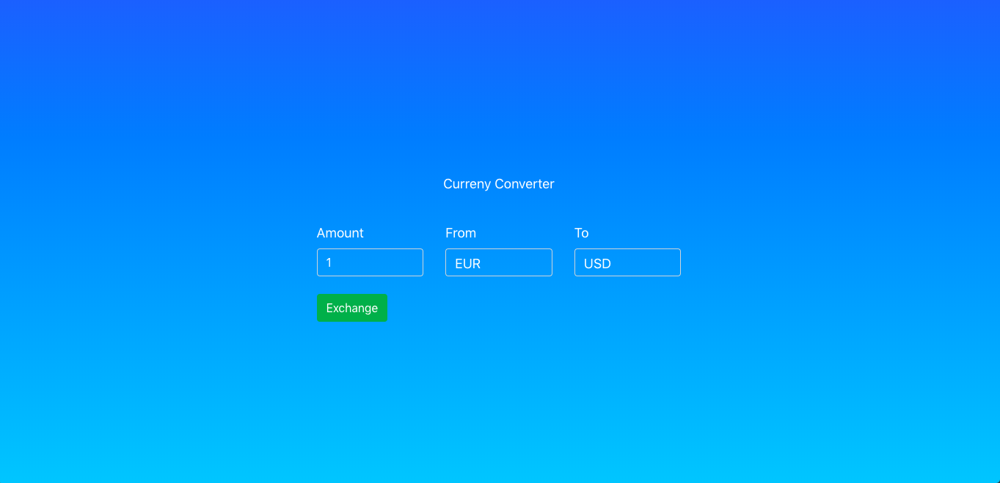

This project was bootstrapped with [Create React App](https://github.com/facebook/create-react-app).

## How to install

1. Clone this repository
2. Run `npm install`
3. cd into your folder
4. Run `npm run start`

## Rates API ( Open )

Here is the link to the Rates Api Documentation

https://ratesapi.io/documentation/

## Get the latest foreign exchange reference rates.
- Endpoint used in app : `GET https://api.ratesapi.io/api/latest `

## Snippit on request with query to endpoint ( with superagent)
``` javascript
request
	.get(`${baseUrl}`)
	.query({base, symbols})
	.then(response => {
		const amountToExchange = parseInt(amount)
		const exchangeTo = symbols
		const newResponse = {...response.body, amountToExchange, exchangeTo}
		dispatch({
			type: SET_CONVERSION,
			payload: newResponse
				})
		})
	.catch(error => {
		dispatch({
			type: SET_ERROR,
			payload: error.response
				})	
	  })
 ```
Link to superagent : https://visionmedia.github.io/superagent/

## App screenshot


